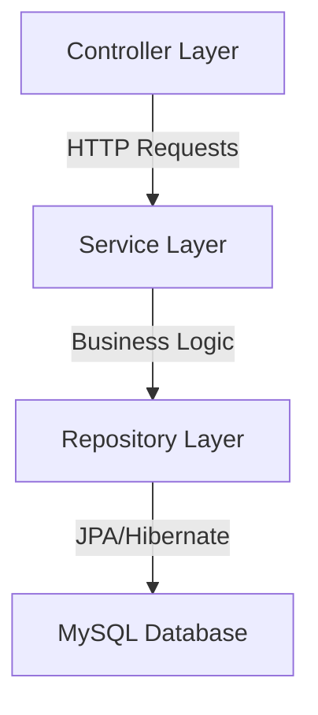

# HealthEcho Architecture Documentation

## Backend Structure



**Core Components:**

-   Entity Models: User, HealthLogs, Reminder
-   JPA Repositories: UserRepository
-   REST Controllers: UserController (needs expansion)
-   Service Layer: Basic user registration handling

## Technology Stack

**Backend (Current Implementation):**

-   Spring Boot 3.1.0
-   Spring Data JPA
-   Hibernate ORM
-   H2 Database (dev)

**Proposed Additions:**

-   Spring Security + JWT
-   ModelMapper for DTO conversion
-   Lombok for boilerplate reduction
-   Validation API

## API Integration Strategy

1.  Axios Configuration:

```javascript
// src/api/client.js
export default axios.create({
    baseURL: "http://localhost:8080/api",
    timeout: 10000,
    headers: { "Content-Type": "application/json" },
});
```

2.  Security Flow:

-   JWT Authentication with refresh tokens
-   React Router protected routes
-   Redux state management for session
